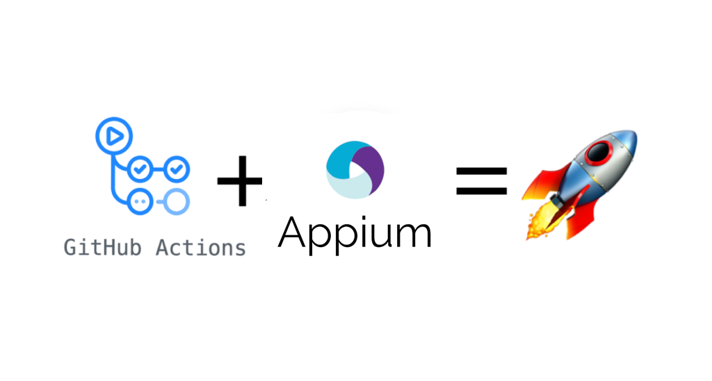
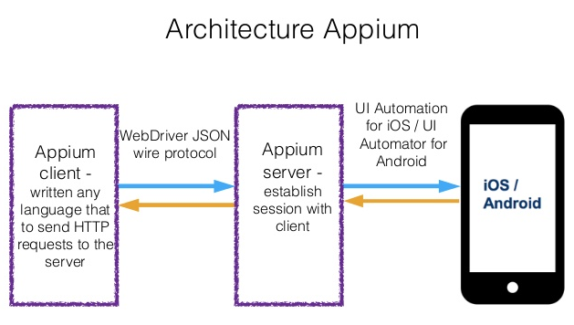

# Appium Server GitHub Action

[](https://github.com/moatazeldebsy/Appium-Server-GitHub-Action/releases)
[](https://github.com/marketplace/actions/appium-server-action)

Running `Appium` Server with `GitHub Action` to be able to run `Appium` mobile test automation scripts (`Android`)

Inspired by the 2020 [GitHub Actions Hackathon.](https://githubhackathon.com/)

### Note
> This action is expected to be run within a ubuntu virtual machine




### What is Appium?
Appium is an open-source test automation framework for use with native, hybrid and mobile web apps. 
It drives iOS, Android, and Windows apps using the WebDriver protocol.




### What is the problem ?
The problem now that, how can we run an Appium server on GitHub Actions?
Because we are using a GUI tool like Appium Desktop on our local machines, So we need to run the Appium server from the command line and in the background to be able to run the rest of the commands.

### The Solution

I created  this GitHub action to install the Appium server using nodeJS and npm then running it in the background.

## Usage

workflow/main.yml:

```yaml
name: Appium CI
on: [push]

jobs:
  Sauce Labs App Automate:
    runs-on: ubuntu-latest
    name: Appium Test
    steps:
      - name: Checkout
        uses: actions/checkout@v2
       - name: Install and Run Appium Server
         uses: moatazeldebsy/appium-server-gitHub-action@V1.0.4
```

<br>

## Usage in in the code

```java
@BeforeClass
    public void setUp() throws MalformedURLException {
        DesiredCapabilities caps = new DesiredCapabilities();
        caps.setCapability("automationName" , "UiAutomator1");
        caps.setCapability("platformName" , "Android");
        caps.setCapability("platformVersion" , "7.1.1");
        caps.setCapability("deviceName" , "Android Emulator");
        caps.setCapability("app" , System.getProperty("user.dir")+"/apps/selendroid-test-app-0.17.0.apk");
        driver = new AndroidDriver<>(new URL("http://localhost:4723/wd/hub"), caps);
    }
```
## Contributing

Are you facing an issue? Have some questions? Would like to implement a new feature? Learn more about our [contributing guidelines](CONTRIBUTING.md).

<br>

## Licence

The project is released under the [MIT License](LICENSE).
